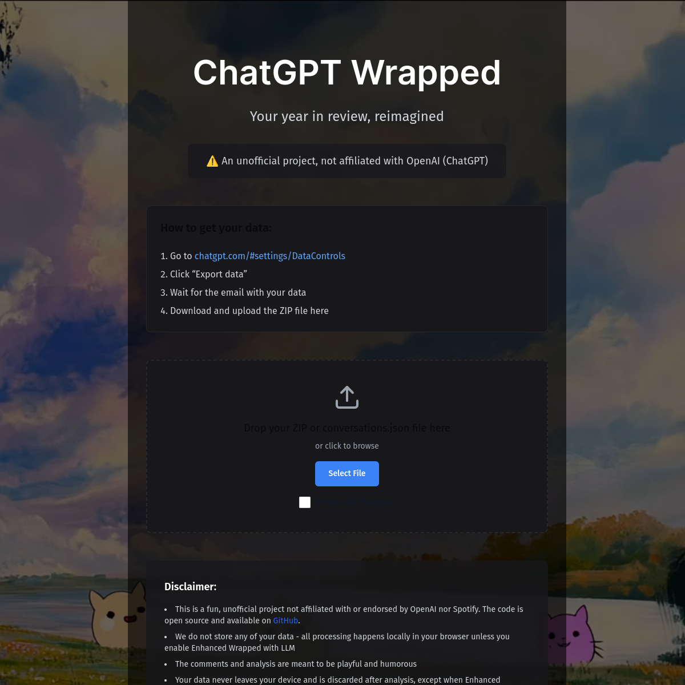

# ChatGPT Wrapped (MVP)

Local-first analytics that turn your ChatGPT export into a Wrapped-style recap. The frontend lives in `apps/web` (Next.js 14), and the analysis stays on-device by default.

## Live Preview

- Deploy: [gptwrapped.vercel.app](https://gptwrapped.vercel.app)



> **Export requirement**: Bring your own ChatGPT data export. The app never calls OpenAI APIs for the core wrapped flow; you import the official ZIP (Settings -> Data Controls -> Export Data), unpack it locally, and the analysis runs locally/offline.

> **Notes on environment**: Commands in this README assume macOS/Linux with Node 22+, Python 3.9+, npm 10+, and a full ChatGPT export available. Some hosted sandboxes block network/filesystem calls, so re-run locally if a command fails due to sandboxing.

## Getting Started

```bash
npm install
npm run dev --workspaces
```

The UI boots with empty metrics until you import your own export via the `/import` page.

If a command fails because of sandboxed network or filesystem access, re-run it locally on your own machine with your own ChatGPT export.
