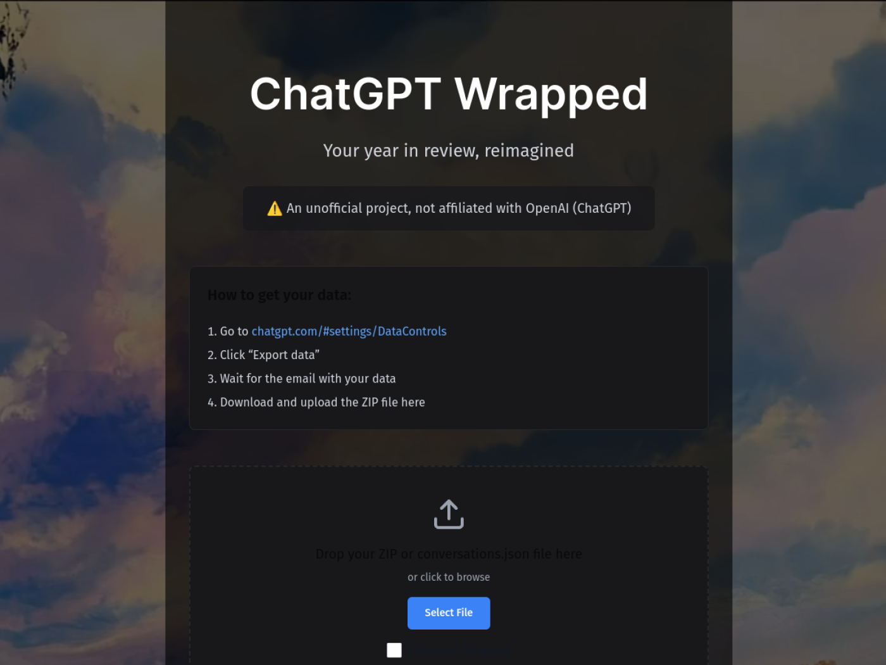

# ChatGPT Wrapped (MVP)

Local-first analytics that turn your ChatGPT export into a Wrapped-style recap. The frontend lives in `apps/web` (Next.js 14), and all computation stays on-device.

[Live app](https://gptwrapped.vercel.app/) · [Deploy to Vercel](https://vercel.com/new/clone?repository-url=https://github.com/Haroutkhac/gptwrapped&project-name=gptwrapped)



> **Export requirement**: Bring your own ChatGPT data export. The app never calls OpenAI APIs; you import the official ZIP (Settings → Data Controls → Export Data), unpack it locally, and the analysis runs entirely on-device/offline.

> **Notes on environment**: Commands in this README assume you’re running locally on macOS/Linux with Node 22+, Python 3.9+, and npm 10+. Some hosted sandboxes block network/filesystem calls, so re-run locally if a command fails due to sandboxing.

## Getting started

```bash
npm install
npm run dev --workspaces
```

The UI boots with empty metrics until you import your own export via the `/import` page.

## What it does

- Imports an official ChatGPT data export and keeps processing local to the browser/device
- Builds Wrapped-style summaries, activity views, and topic breakdowns
- Exports shareable recap artifacts without sending your data to a backend

If a command ever fails because of sandboxed network or filesystem access, re-run it locally. This repo assumes you’re on your own machine with your own ChatGPT export.
